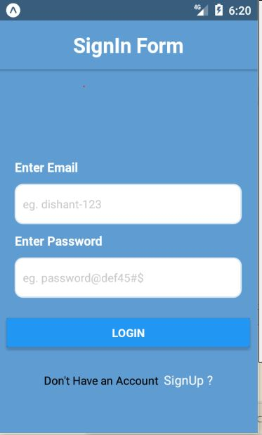
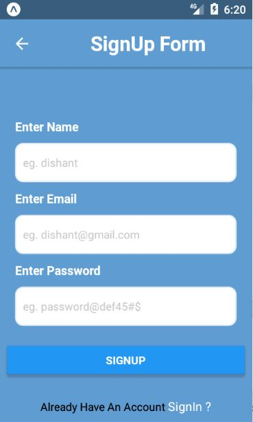
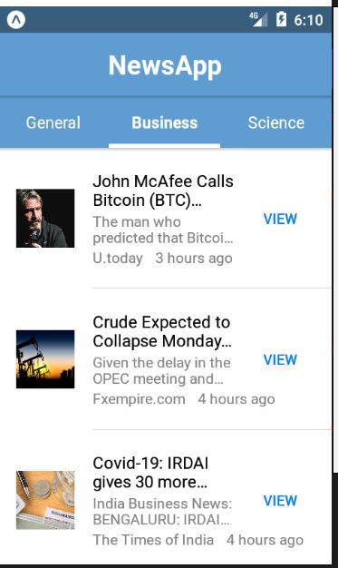

# news-app-react-native
<html>
<h4>This is a news App which shows article on latest news on topics like Buissness, General, Technology</h4>
<ul>
  <li>Uses Expo to start the server and to run application on android emulator.</li>
  <li>Uses NewsAPI to fetch news related data.</li>
  <li>For BackEnd(for uses Authentication like login, signUp details) I use MongoDb with Express</li>
  <li>Native Base Library for styling.</li>
  <li>Uses switch Navigation and stack Navigation toswitch between components</li>
</ul>

<h1>Images </h1>

</html>

# SignIn Page

# SignUp Page

# Home Page

